# Option 1 – Google Workspace Events API
**Status:** 🔄 Proposed

## 📋 Description
Subscribe to Google Meet events using the Google Workspace Events API and receive real-time events when participants join/leave.
The events are received via a Google Cloud Pub/Sub topic.
When an [event](#event) is received, we need to get the participant email from the [user id](#user-id).

> 📝 **Note:** Details on how to get participant emails are available [here](https://developers.google.com/workspace/meet/api/guides/participants)

## 🔄 Implementation Options

Three implementation approaches are possible: 
### 👤 Option A: Individual User Authorization
The idea is that each user can individually authorize the app to access their Google Meet events. This is done through OAuth 2.0 consent, where users can grant permission for the app to receive notifications about their meeting participation (join/leave). The app then receives the events via the Google Workspace Events API and gets the participant email from the user ID or token.

**See:** [User-Level Subscription](#how-to-subscribe-to-google-meet-events)

### 🤝 Option B: Co-organizer Participant
We create a specific workspace member that can be added as co-organizer in meetings. This user grants the app permission to access their Google Meet events.
The app subscribes to meets (spaces) where this user is a co-organizer and receives events for all participants.
The app should find a way to get the emails from user IDs.

### ⚠️ Option C: Admin Domain-Wide Authorization
The admin can authorize the app to access all users' Google Meet events without individual consent. This is done through domain-wide delegation, where the admin grants the app permission to act on behalf of users in the domain.

**See:** [Domain-Wide Delegation](#how-to-subscribe-to-google-meet-events)

> ⚠️ **Warning:** This solution requires extensive permissions and may raise privacy concerns.

We can try to limit the received events by creating a participant that can be invited to meetings. When this is the case, the app subscribes only to those meetings and thus reduces the spectrum of events received.

## 📋 Assumptions & Constraints
- Google Cloud project
- Google Pub/Sub topic
- Google Workspace Events API enabled in Google Cloud project
- OAuth 2.0 grants by users or admin permissions depending on the implementation option chosen

## 🏗️ High Level Design  

```mermaid
sequenceDiagram
    participant GM as 🎥 Google Meet
    participant API as 📡 Workspace Events API
    participant PS as ☁️ Cloud Pub/Sub
    participant APP as 🔧 Our Application
    participant PA as 📊 People API

    Note over GM,PA: User joins/leaves meeting
    
    GM->>API: Meeting event occurs
    API->>PS: Publish event to topic
    PS->>APP: Deliver event notification
    
    Note over APP: Extract participant ID from event
    
    APP->>PA: Get participant details
    PA->>APP: Return user info with email
    
    Note over APP: Process participant email
```


## 🛠️ Implementation Details

### 🔗 How to Subscribe to Google Meet Events?

#### 1- User-Level Subscription (OAuth Consent)
A single user authorizes your app using OAuth. Meet events (join/leave/etc.) only for that user.

**What You Get:** Events for meetings where the user is:
- 👤 Organizer
- 🤝 Participant  
- 🎯 Host

**📋 Permissions Required:**
- OAuth consent from the user
- **Scopes:**
  - `https://www.googleapis.com/auth/meetings.space.readonly`
  - `https://www.googleapis.com/auth/cloud-identity.users.readonly`
  - Events-specific scopes (implicit via Workspace Events API)
- Setup a Pub/Sub topic for event delivery

**⏰ OAuth Token Expiry:**
- OAuth tokens expire after 1 hour. You need to refresh the token periodically.
- Refresh Token does not expire by default for most Workspace accounts.

#### 2- Meeting Space-Level Subscription (Individual Meeting Space)
Subscribe to a specific Google Meet space (meeting).
Receive events for all participants in that space.

**📋 Permissions Required:**
Only a user with access to that meeting space can create the subscription.

- Access typically means the user is:
  - 📅 The calendar event organizer
  - 👥 An owner or participant in the space
  - 🎯 A co-host (depending on meeting configuration)

#### 3- Domain-Wide Delegation (Workspace-Wide Impersonation)
Receive Meet events for all users in the Workspace domain without individual OAuth consent.

**📋 Permissions Required:**
- 🔑 Workspace super admin access
- Enable domain-wide delegation in Google Cloud Console
- Create a service account with:
  - **OAuth scopes:**
    - `https://www.googleapis.com/auth/admin.directory.user.readonly`
    - `https://www.googleapis.com/auth/meetings.space.readonly`
  - Impersonate each user to create user-based subscriptions programmatically


### Supported Notification Endpoints (⚠️)

When you use the Google Workspace Events API to subscribe to Google Meet (or other Workspace) events, the **only supported way** to receive notifications is via **Google Cloud Pub/Sub topics**. You cannot push events directly to a custom REST endpoint.

**📚 Reference:** [NotificationEndpoint Documentation](https://developers.google.com/workspace/events/reference/rest/v1/subscriptions#NotificationEndpoint)

### How to Get Participant Email from User ID? (✅)

**📚 Reference:** [Participants Guide](https://developers.google.com/workspace/meet/api/guides/participants)

**🔄 Process Overview:**

When you receive a Meet Event (e.g., `participant.v2.joined`) via Google Workspace Events API:

```json
{
  "eventType": "google.workspace.meet.participant.v2.joined",
  "participantSession": {
    "name": "conferenceRecords/{conferenceId}/participants/{participantId}/participantSessions/{sessionId}"
  }
}
```

**📚 Reference:** [Meet Events Guide](https://developers.google.com/workspace/events/guides/events-meet)

**🔢 Step-by-Step Process:**

1️⃣ **Extract IDs from the participantSession.name:**
   ```
   conferenceRecords/abcd1234/participants/xyz789/participantSessions/aaa111
   ```
   - `conferenceId` = `abcd1234`
   - `participantId` = `xyz789`

2️⃣ **Fetch Participant Info:**
   Call the Meet REST API:
   ```
   GET https://meet.googleapis.com/v2/conferenceRecords/{conferenceId}/participants/{participantId}
   ```
   **📚 Reference:** [Participants API](https://developers.google.com/workspace/meet/api/reference/rest/v2/conferenceRecords.participants/get)

3️⃣ **Resolve Email from User ID:**
   Use the People API:
   ```
   GET https://people.googleapis.com/v1/{user}?personFields=emailAddresses
   ```
   Where `{user}` is from `signedInUser.user` (e.g., `users/1234567890`)
   
   **📚 Reference:** [People API](https://developers.google.com/people/api/rest/v1/people/get)

### How to Get Calendar Description? (✅)

When you receive a Meet Event and need to extract the calendar description for additional meeting context:

1️⃣ **Extract Conference Record from Meet Event:**
   From the Meet event, extract the `conferenceRecord` resource:
   ```
   conferenceRecords/CONFERENCE_ID
   ```

2️⃣ **Retrieve Conference Record Details:**
   Use the Google Meet REST API to get conference metadata:
   ```
   GET https://meet.googleapis.com/v2/conferenceRecords/{conferenceId}
   ```
   This will include metadata such as the associated Calendar event ID or Calendar link.

3️⃣ **Fetch Calendar Event Details:**
   With the event ID and calendar ID (typically the user's primary Calendar), call the Google Calendar API:
   ```
   GET https://www.googleapis.com/calendar/v3/calendars/{calendarId}/events/{eventId}
   ```

4️⃣ **Extract Description:**
   The returned Event resource includes:
   - `description` field (meeting description)
   - `summary` (meeting title)
   - `location` (meeting location)
   - `attendees` (participant list)

**⚠️ OAuth Scopes Required:**
- **Workspace Events and Meet API subscriptions:** Appropriate domains/delegated access
- **Meet REST API:** `https://www.googleapis.com/auth/meetings.readonly` (or broader) access
- **Calendar API:** `https://www.googleapis.com/auth/calendar.readonly` or equivalent access

### 💰 Google Cloud Pub/Sub Pricing (✅)

**📊 Cost Estimate:** Google Cloud Pub/Sub costs for processing Google Meet join/leave events for:
- 8 meetings per day
- 50 users per meeting  
- Events: join + leave (2 events per user per meeting)

**✅ Estimated Pub/Sub cost: $0/month** (assuming standard usage and regional configuration)

**📈 Calculation Details:**

```
50 users × 2 events (join + leave) = 100 events per meeting
8 meetings/day × 100 events = 800 events/day
Monthly (30 days) = 24,000 events/month
```

CloudEvents delivered via Pub/Sub (JSON format) average ~1–3 KB per message depending on whether `payloadOptions.includeResource = true`.

Let's conservatively estimate **2.5 KB per message**.

```
24,000 events/month × 2.5 KB = ~60 MB per month throughput
```

This is well within the **10 GiB/month free tier**.


## ⚠️ Risks & Mitigations

| Risk | 🛡️ Mitigation |
|------|---------------|
| **📈 API Changes** | Implement version monitoring and gradual migration strategies |
| **📉 Event Delivery Failures** | Hybrid polling backup system for active meetings |
| **⏱️ Rate Limiting** | Implement exponential backoff and request queuing |
| **🔒 Data Privacy** | GDPR-compliant data handling with user consent mechanisms |
| **📡 Webhook Reliability** | Multi-region deployment with failover capabilities |

---

## 📚 Resources

### 📖 Documentation Links
- [Google Workspace Events API Documentation](https://developers.google.com/workspace/events)
- [Google Workspace Events API Reference](https://developers.google.com/workspace/events/reference/rest/v1/subscriptions)
- [Google Meet Events Guide](https://developers.google.com/workspace/events/guides/events-meet)
- [Google Meet API Reference](https://developers.google.com/workspace/meet)
- [Google Calendar API Events](https://developers.google.com/calendar/api/v3/reference/events/get)
- [Cloud Pub/Sub Integration Guide](https://cloud.google.com/pubsub/docs)
- [Webhook Security Best Practices](https://developers.google.com/workspace/guides/webhook-security)
