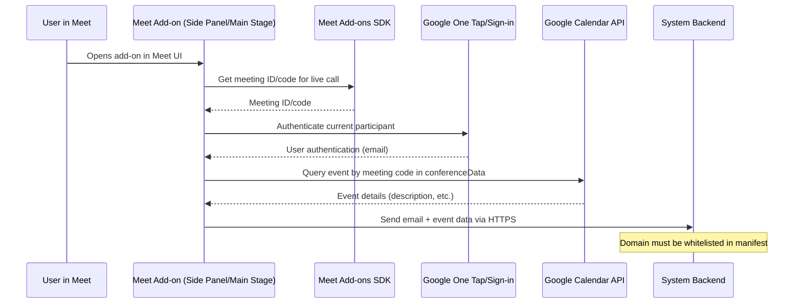

# Option 2 – Google Meet SDK
**Status:** 🔄 Proposed

## 📋 Description
Use Google Meet SDK to build custom meet add-on that will be added to the workspace or for individual users manually. The Addon will get access to the current meet space and get the current user email. then it can fetch calendar related information see [how-to-get-calendar-description](./1-google-workspace-events-api.md#how-to-get-calendar-description-✅) 

⚠️ Google Meet SDK (add‑ons) doesn’t directly expose a real‑time API to list participants inside your add-on frontend.

## 📋 Assumptions & Constraints
- Google Cloud project
- Google Meet SDK enabled in Google Cloud project
- Addon installed in the workspace
- OAuth 2.0 consent for user authorization

## 🏗️ High Level Design  

## 🛠️ Implementation Details

### What is the Google Meet SDK?
The Google Meet SDK is a collection of tools and libraries that let developers integrate Google Meet capabilities directly in their applications, particularly for web-based Meet add‑ons. These integrations run inside Google Meet’s UI—typically as a side panel or main stage iframe—and enable users to interact with third‑party apps without leaving the meeting environment.

Build Meet Add‑ons that run inside Google Meet (as side‑panel or main stage), enabling shared tools, co‑watching, screen sharing, notes, Q&A, or integrations with external services.

### Who Can Install Meet Add‑Ons?
✅ Individual Users
Users can browse the Google Workspace Marketplace directly from the Meet UI (via the Activities panel), discover available add‑ons, and install them for their own accounts.

✅ Workspace Administrators
Administrators in a Google Workspace organization can install add‑ons centrally for an entire domain, specific organizational units, or groups. They also control policies like allow‑listing and whether user installations are permitted.

### Cost

There is no fee charged by Google to deploy or list your app on the Google Workspace Marketplace—whether you publish publicly or privately.